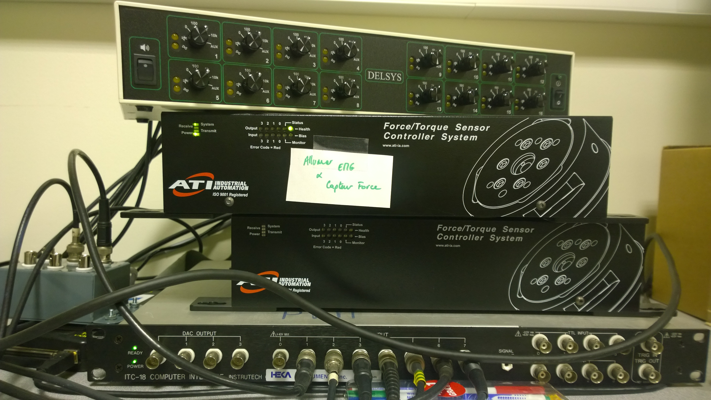
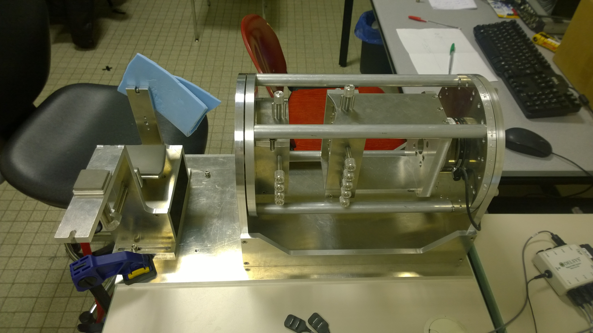
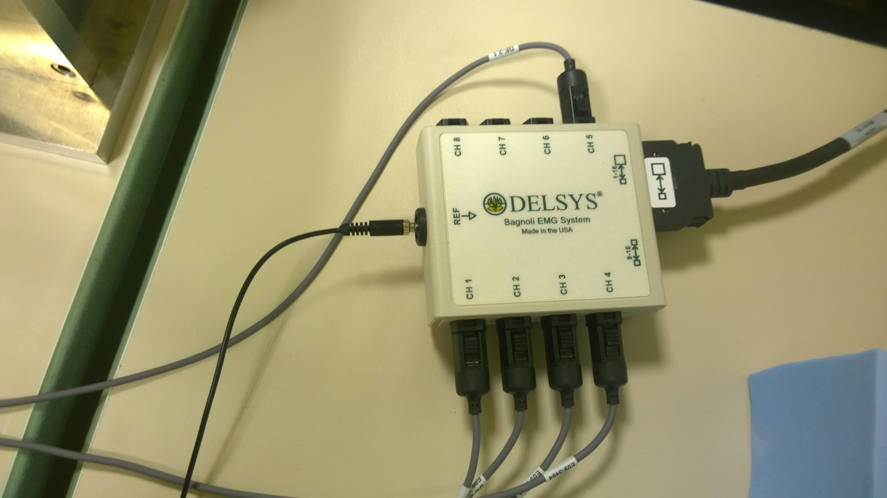
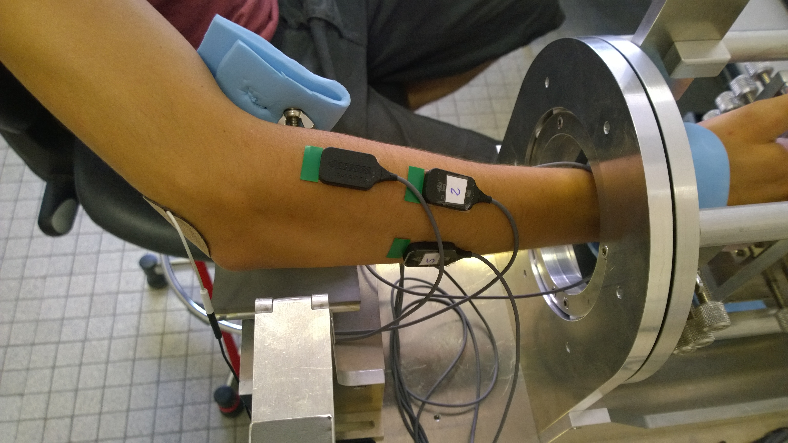
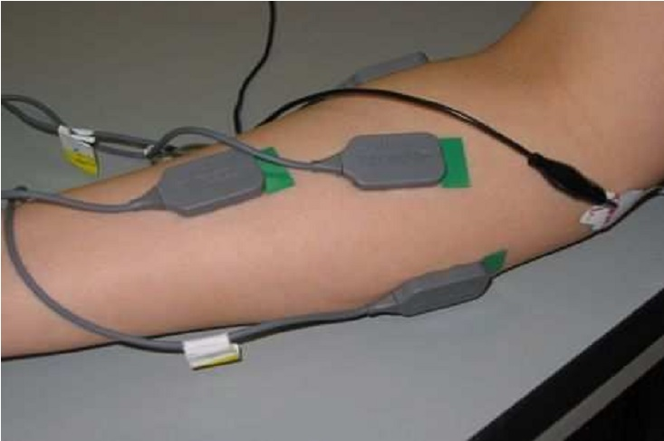
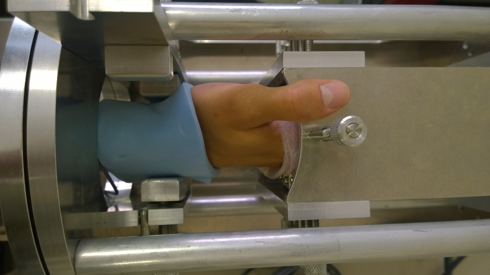

# EMG Signal Processing

This software works with a very special Hadware, the development was made in the research Center INCIA-Bordeaux,
if you want do some experience you need the following hadware:

## Connections »

You have to place the electrodes in the followins positions:

Then, it is necessary fixe the wrist into the machine:

Now you can start the software, first it's necessary launch the software of acquisition:

*Poppy_Force_Driver.m*

Once you've collected the EMG data, you need to launch the software of learning:

*model_par_cibles.m*

Finally, when you've obtained the mathematical model you can start to control only with your EMG signals, like in this [video](https://vimeo.com/134840606), using the code of the following file:

*poppy_ExpEMGDriven.m*

*Note: All the files are in the folder [Software](https://github.com/joelortizsosa/EMG_Processing/tree/master/Software)*

-------------

## Data sets

IF you dont have the hadware necessary to do your own experiences, but you want to try different methods for processing the electromyographic signals. We keep a database of the different subjects to which we tested.

You can find this database in the folder [Data sets] (https://github.com/joelortizsosa/EMG_Processing/tree/master/Data%20sets).

The database of each subjects was created in matlab and they are arranged as follows

| Force Z  | Force X | Force Y | Elec 1 | Elec 2 | Elec 3 | Elec 4 | Elec 5 | DataTrimmed | Pos X | Pos Y |
| --------:|:-------:|:-------:|:------:|:------:|:------:|:------:|:------:|:-----------:|:-----:|:-----:|

*Note: La force est at Newtons and the Position in pixels*
